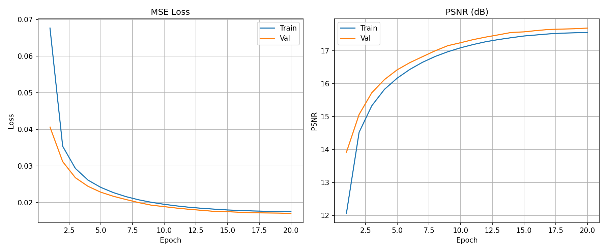
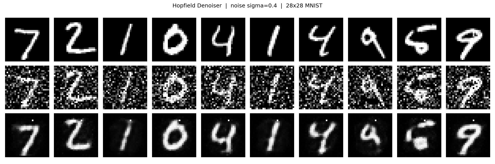

## Цель работы

Цель данной практической работы — построить рекуррентную нейросетевую модель для восстановления (денойзинга) изображений на основе **сети Хопфилда**. В качестве обучающего набора используются цифры рукописных чисел из датасета MNIST, масштабированные до 28x28 пикселей. Сеть обучается восстанавливать чистый образ по его зашумлённой версии, используя принцип минимизации энергии ассоциативной памяти.

---

## Содержание практической работы

### 1. Набор данных

В качестве обучающего множества использован стандартный датасет **MNIST** — 70 000 изображений рукописных цифр (0-9), разбитых на 60 000 обучающих и 10 000 тестовых примеров. Изображения конвертируются в оттенки серого. (Рисунок 1).

Для имитации зашумлённых входных образов к каждому изображению во время обучения добавляется **гауссовский шум** с sigma = 0.4; значения пикселей ограничиваются диапазоном [0, 1]. Датасет загружается автоматически средствами `torchvision` при первом запуске обучения.

```
Обучение (train): 60 000 изображений x 10 классов (цифры 0-9)
Тест    (test):   10 000 изображений x 10 классов
Размер:           28x28 px, градации серого
```

---

### 2. Реализация приложения

Технологии:

- **Язык программирования:** Python 3.10+
- **ML-библиотеки:** PyTorch, torchvision
- **Визуализация:** Matplotlib

| Файл | Назначение |
|---|---|
| `config.py` | Гиперпараметры и пути |
| `model.py` | Архитектура `HopfieldDenoiser` |
| `train.py` | Загрузка данных, цикл обучения, восстановление |

#### 2.1 Конфигурация (`config.py`)

```python
MNIST_ROOT   = Path("mnist_data")   # директория для хранения датасета
CKPT_DIR     = Path("hopfield_checkpoints")
IMG_SIZE     = 28         # размер изображения (пикселей)
LATENT_DIM   = 64         # ранг факторизации весовой матрицы W = A @ A^T
NUM_STEPS    = 8          # число итераций обновления Хопфилда
BETA         = 5.0        # коэффициент «температуры» в sigmoid(beta * ...)
BATCH_SIZE   = 256
EPOCHS       = 20
LR           = 1e-3
NOISE_FACTOR = 0.4        # sigma гауссовского шума при обучении
```

#### 2.2 Архитектура модели (`model.py`)

Реализован класс **`HopfieldDenoiser`** — непрерывная сеть Хопфилда (Continuous Hopfield Network), используемая как ассоциативная память для восстановления изображений.

Изображение 28x28 разворачивается в вектор из **784 элементов**. Весовая матрица сети параметризуется через низкоранговую факторизацию `W = A @ A^T` (матрица `A` размерности 784 x 64), что снижает число параметров с ~615 000 до ~50 000. На каждой итерации применяется синхронное обновление состояний нейронов:

```
x_{t+1} = sigmoid(beta * (W @ x_t + b))
```

где `beta` — коэффициент, управляющий «крутизной» функции активации, а `b` — обучаемый вектор смещений. После `NUM_STEPS` итераций зашумлённое изображение притягивается к ближайшему выученному аттрактору — чистому образу.

Энергетическая функция сети Хопфилда:

```
E(x) = -0.5 * x^T W x - b^T x
```

Каждое обновление снижает энергию, двигая состояние системы к локальному минимуму.

```
Вход:  (B, 1, 28, 28)  -- зашумлённое изображение
  |
  |-- reshape -> (B, 784)           вектор пикселей
  |
  |-- Hopfield update x NUM_STEPS:
  |     h = x @ A                   (B, 64)
  |     Wx = h @ A^T                (B, 784)
  |     x = sigmoid(beta * (Wx + b))
  |
  |-- reshape -> (B, 1, 28, 28)     восстановленное изображение
```

```python
class HopfieldDenoiser(nn.Module):
    def __init__(self, img_size=28, latent_dim=64, num_steps=8, beta=5.0):
        super().__init__()
        self.n = img_size * img_size          # 784
        self.latent_dim = latent_dim
        self.num_steps = num_steps
        self.beta = beta

        # W = A @ A^T  (симметричная положительно-полуопределённая матрица)
        self.A = nn.Parameter(torch.randn(self.n, latent_dim) * scale)
        self.bias = nn.Parameter(torch.zeros(self.n))

    def forward(self, x):
        b, c, h, w = x.shape
        x = x.view(b, self.n)
        for _ in range(self.num_steps):
            h = x @ self.A
            Wx = h @ self.A.t()
            x = torch.sigmoid(self.beta * (Wx + self.bias))
        return x.view(b, c, h, w)
```

#### 2.3 Цикл обучения (`train.py`)

На каждом шаге обучения к чистому батчу добавляется шум; модель минимизирует **MSE** между восстановленным и чистым изображениями. В качестве метрики качества отслеживается **PSNR** (дБ). Градиенты распространяются через все `NUM_STEPS` итераций обновления Хопфилда (unrolled computation graph).

```python
noisy  = clean + NOISE_FACTOR * torch.randn_like(clean)
output = model(noisy.clamp(0, 1))
loss   = nn.MSELoss()(output, clean)
```

Оптимизатор — **Adam**, планировщик скорости обучения — косинусное затухание (`CosineAnnealingLR`). Лучший чекпоинт по PSNR на тестовой выборке сохраняется в `hopfield_checkpoints/best.pt`.

```
Epoch   1/20 | train loss 0.02341 PSNR 16.30 | val loss 0.02289 PSNR 16.40
Epoch   2/20 | train loss 0.01812 PSNR 17.42 | val loss 0.01774 PSNR 17.51  <- best
...
```

---

### 3. Запуск

Установка зависимостей:

```bash
pip install -r requirements.txt
```

**Обучение** (MNIST загружается автоматически при первом запуске):

```bash
python train.py train
```

По завершении в `hopfield_checkpoints/` сохраняются `best.pt`, `last.pt` и `training_curves.png`.

**Восстановление зашумлённого изображения:**

```bash
# изображение уже зашумлено
python train.py restore --input path/to/noisy.png

# добавить шум sigma=0.5 перед восстановлением
python train.py restore --input path/to/clean.png --noise 0.5
```

Результат сохраняется рядом с исходным файлом (`*_restored.png`) вместе со сравнительным изображением (`*_comparison.png`).

**Демонстрация** — визуализация троек (чистый / зашумлённый / восстановленный) на 10 тестовых примерах:

```bash
python train.py demo
```

Результат сохраняется в `hopfield_checkpoints/demo.png`.

---

### 4. Результаты обучения

По завершении обучения автоматически строятся графики динамики MSE-потерь и PSNR на тренировочной и тестовой выборках и сохраняются в `hopfield_checkpoints/training_curves.png` (Рисунок 2).



Пример визуальных результатов денойзинга (Рисунок 3):



---

## Вывод

В ходе выполнения практической работы реализован конвейер восстановления изображений на основе непрерывной сети Хопфилда. Модель `HopfieldDenoiser` использует низкоранговую факторизацию весовой матрицы `W = A @ A^T` и многошаговое итеративное обновление состояний нейронов `x_{t+1} = sigmoid(beta * (W @ x_t + b))`, обучаясь на парах «зашумлённое -> чистое» из датасета MNIST (28x28 px). Сеть успешно подавляет гауссовский шум (sigma = 0.4), притягивая зашумлённые образы к ближайшим аттракторам ассоциативной памяти. Разработанный код разбит на независимые модули (`config.py`, `model.py`, `train.py`) с единой точкой входа и поддержкой режимов обучения, восстановления отдельного изображения и демонстрации результатов.
